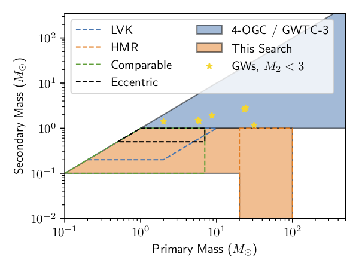
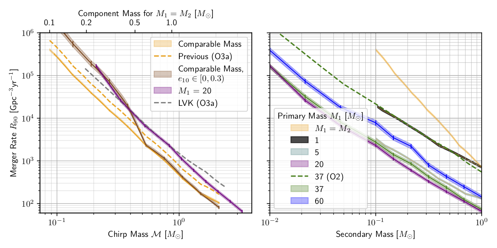

# Broad search for gravitational waves from subsolar-mass binaries through LIGO and Virgo's third observing run
**Alexander H. Nitz<sup>1, 2</sup>, Yi-Fan Wang<sup>1, 2</sup>**

## Introduction ##

We present a search for gravitational waves from the coalescence of binaries which contain at least one subsolar mass component using data from the LIGO and Virgo observatories through the completion of their third observing run.  The observation of a merger with a component below 1 Msun would be a clear sign of either new physics or the existence of a primordial black hole population; these black holes could also contribute to the dark matter distribution. Our search targets binaries where the primary has mass M_1 between 0.1-100 Msun and the secondary has mass M_2 from 0.1-1 Msun for M_1 < 20 Msun and 0.01-1 Msun for M_1 >= 20 Msun. Sources with M_1 < 7 Msun, M_2 > 0.5 Msun are also allowed to have orbital eccentricity up to e_{10} ~ 0.3. This search region covers from comparable to extreme mass ratio sources up to 10^4:1. We find no statistically convincing candidates and so place new upper limits on the rate of mergers; our analysis sets the first limits for most subsolar sources with 7 Msun< M_1 < 20 Msun and tightens limits by ~ 8x (1.6x) where M_1 > 20 Msun (M_1 < 7 Msun). Using these limits, we constrain the dark matter fraction to below 0.3(0.7)% for 1 (0.5) Msun black holes assuming a monochromatic mass function. Due to the high merger rate of primordial black holes beyond the individual source horizon distance, we also use the lack of an observed stochastic background as a complementary probe to limit the dark matter fraction. We find that although the limits are in general weaker than those from the direct search they become comparable at 0.1 Msun.

A preprint version of the paper is [available on arxiv](https://arxiv.org/abs/2202.xxxxx).
This release contains configuration files of the search. 

The rate limits are contained in two text files in the 'upper_limits' folder. These contain the limits
as a function of chirp mass for the merger rate for non-eccentric sources as well as for a populuation
where the eccentricity ranges from 0 to 0.3. The equivelant VT of the search for these two cases is also given
in separate files as a function of chirp mass. The VT is comparable for mass ratios within our searched region at fixed
chirp mass, so can be extended in this way to a full distribution over m1/m2. 

## Search region:


## Rate limits:


## License and Citation


This work is licensed under a [Creative Commons Attribution-ShareAlike 3.0 United States License](http://creativecommons.org/licenses/by-sa/3.0/us/).

We encourage use of these data in derivative works. If you use the material provided here, please cite the paper using the reference:

```
@article{Nitz:2021vqh,
    author = "Nitz, Alexander H. and Wang, Yi-Fan",
    title = "{Broad search for gravitational waves from subsolar-mass binaries through LIGO and Virgo's third observing run}",
    eprint = "2202.xxxxx",
    archivePrefix = "arXiv",
    primaryClass = "astro-ph.HE",
    month = "2",
    year = "2022"
}
```
