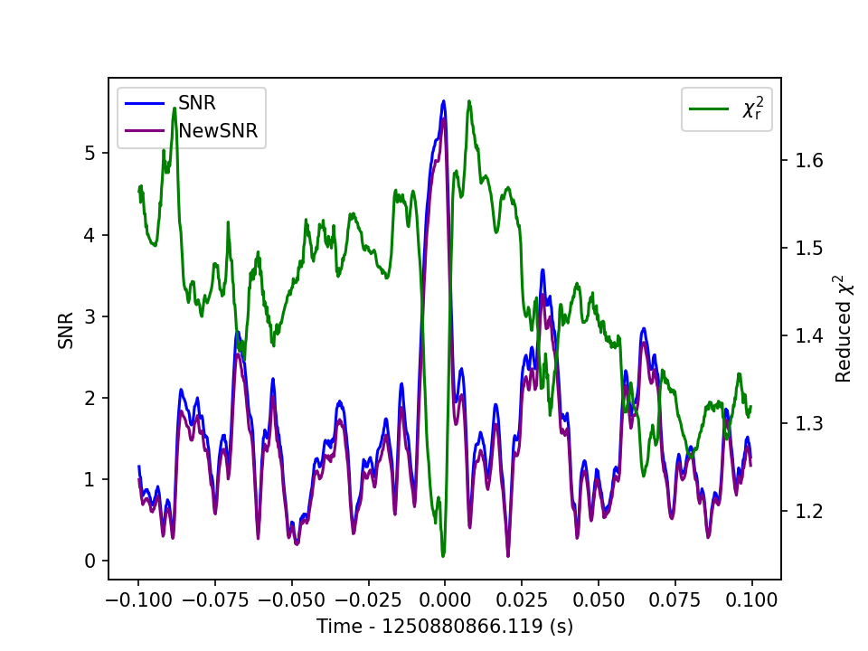
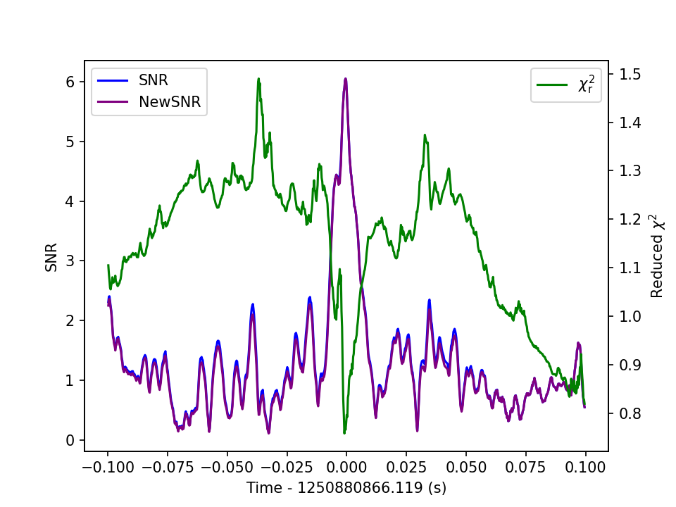

We examine the most significant trigger which has a false alarm rate every 1.8 years. The GPS time and template parameters are

| GPS time  | m1 | m2 | approximate
| ------------- | ------------- | ------------- |------------- |
|  1250880866.119141 | 10.705900  | 0.102476| EOBNRv2 |

We plot the SNR, newSNR and chi^2 for the trigger in LIGO Hanford and LIGO Livingston:

- LIGO-Hanford:

- LIGO-Livingston:

